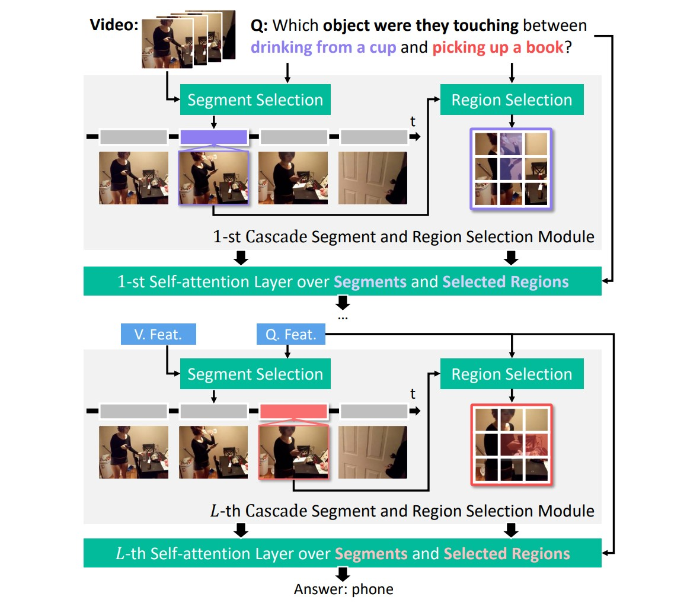

# MIST: Multi-modal Iterative Spatial-Temporal Transformer for Long-form Video Question Answering
[](LICENSE)
[](https://www.python.org/)


[[CVPR 2023](https://openaccess.thecvf.com/content/CVPR2023/papers/Gao_MIST_Multi-Modal_Iterative_Spatial-Temporal_Transformer_for_Long-Form_Video_Question_Answering_CVPR_2023_paper.pdf)]

> **MIST: Multi-modal Iterative Spatial-Temporal Transformer for Long-form Video Question Answering**
> <br>Difei Gao, Luowei Zhou, Lei Ji, Linchao Zhu, Yi Yang, Mike Zheng Shou<br>

 

### Requirements

1. Pytorch >= 1.9.0 (Tested on Pytorch 1.11.0 with CUDA 11.3)
2. We have performed experiments on NVIDIA GeForce A5000 GPU 24GB GPU
3. See [`requirements.txt`](requirements.txt) for the required python packages and run to install them

Let's begin from creating and activating a Conda environment an virtual environment 
```
conda create --name mistenv python=3.7
conda activate mistenv
```
Then, clone this repository and install the requirements.
```
$ git clone https://github.com/showlab/mist.git
$ cd mist
$ pip install -r requirements.txt
```

### Data Preparation
You can either download the feature from our shared drive or extract by your own with the given script.

1. Option 1: Download features from online drive:
[Open Google Drive Folder]()
This folder provides the dataset annotation files and features. In our experiments, we place the data folder under the same root with code folder.

2. Option 2: Extract by running the script in `extract\extract_clip_features.ipynb`.
The code extract the patch features of the video frames.
The script also provides a checking code to see if you extracted features work correctly. 

### Training
Simply run the shell `agqa_v2_mist.sh` in the `shells\` to start training.
```
./shells/agqa_v2_mist.sh
```
or input the command below on the terminal.
```
CUDA_VISIBLE_DEVICES=6 python main_agqa_v2.py --dataset_dir='../data/datasets/' \
	--feature_dir='../data/feats/'  \
	--checkpoint_dir=agqa \
	--dataset=agqa \
	--mc=0 \
	--epochs=30 \
	--lr=0.00003 \
	--qmax_words=30 \
	--amax_words=38 \
	--max_feats=32 \
	--batch_size=128 \
	--batch_size_val=128 \
	--num_thread_reader=8 \
	--mlm_prob=0 \
	--n_layers=2 \
	--embd_dim=512 \
	--ff_dim=1024 \
	--feature_dim=512 \
	--dropout=0.3 \
	--seed=100 \
	--freq_display=150 \
	--save_dir='../data/save_models/agqa/mist_agqa_v2/'
```
Change the dataset_dir, feature_dir and save_dir based on where your store the downloaded data and features.

You can refer our training logs to check if you are running correctly.

### Ackonwledgements
We are grateful to just-ask, an excellent VQA codebase, on which our codes are developed.

### Bibtex
```
@inproceedings{gao2023mist,
  title={MIST: Multi-modal Iterative Spatial-Temporal Transformer for Long-form Video Question Answering}, 
  author={Difei Gao and Luowei Zhou and Lei Ji and Linchao Zhu and Yi Yang and Mike Zheng Shou},
  booktitle={Proceedings of the IEEE/CVF Conference on Computer Vision and Pattern Recognition},
  pages={14773--14783},
  year={2023}
}
```
